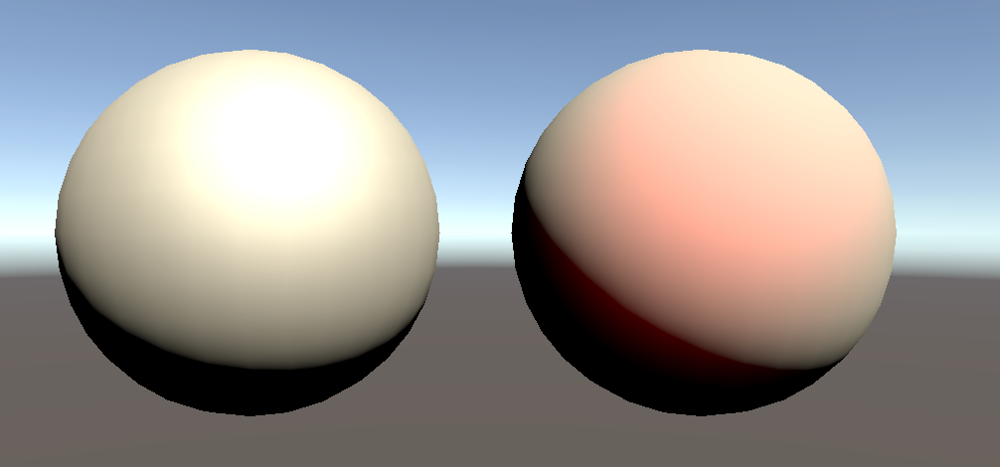

# Unity Basic Shader Examples

This repository includes basic shader examples in two categories; texture manipulation and lighting. These basic examples can be used to create more complex shaders.

## Lighting Examples

This section includes examples for basics of lighting, reflections, shadows, etc.

**Diffuse Reflection (Lambert Lighting):**

**Specular Reflection (Phong Lighting):**

**Environmental Reflection:**

**Fresnel (Rim) Effect:**

**Shadows:**

**Normal Map:**

## Basic Examples

This section includes examples for basics of texture manipulation such as repeating, sectioning, smooth step, solid gradient, zoom, etc.

